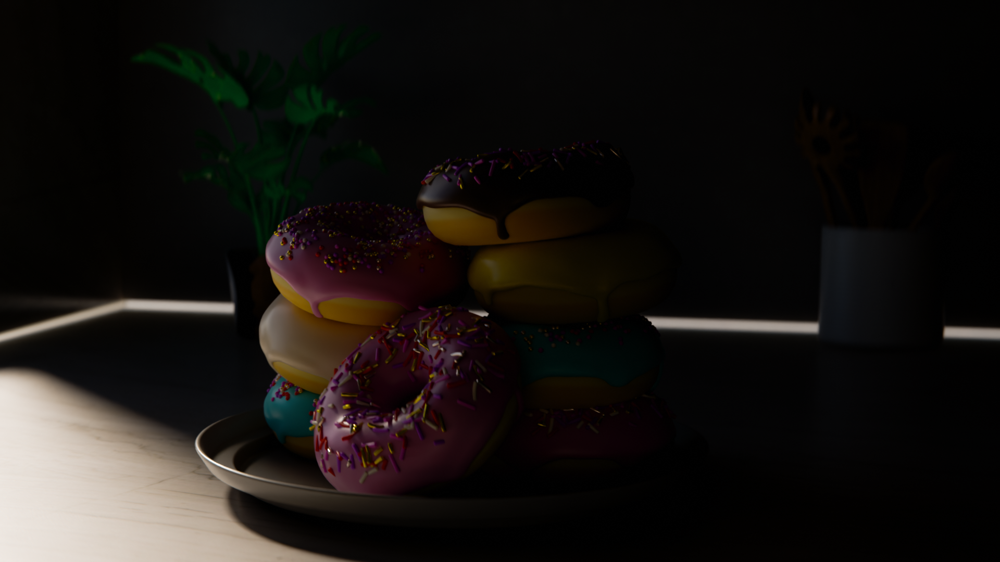

Blender Donut – Marko Edition

  

A ready-made Blender donut project.
No tutorials.
No pink sprinkles hell.
Download and see for yourself.

Included

Final .blend file

Final render (PNG)

Required texture PNG

Everything needed to open and render immediately

Notes

The donut color is driven by shader nodes.
The PNG texture is included only because some assignments demand it.

Usage

Download → Open in Blender → Done.

Enjoy the shortcut. Or don’t.

Tested with Blender 4.3

– Marko
